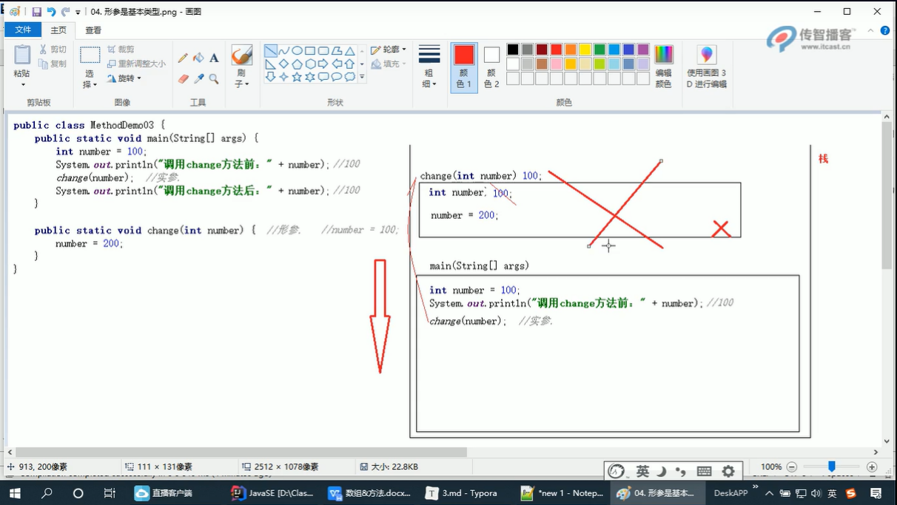
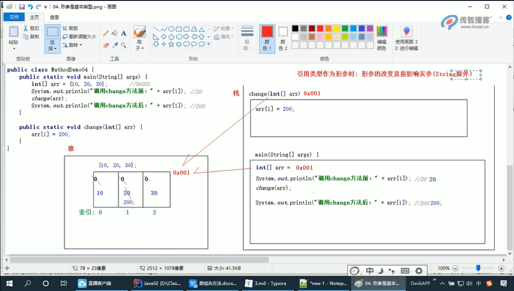
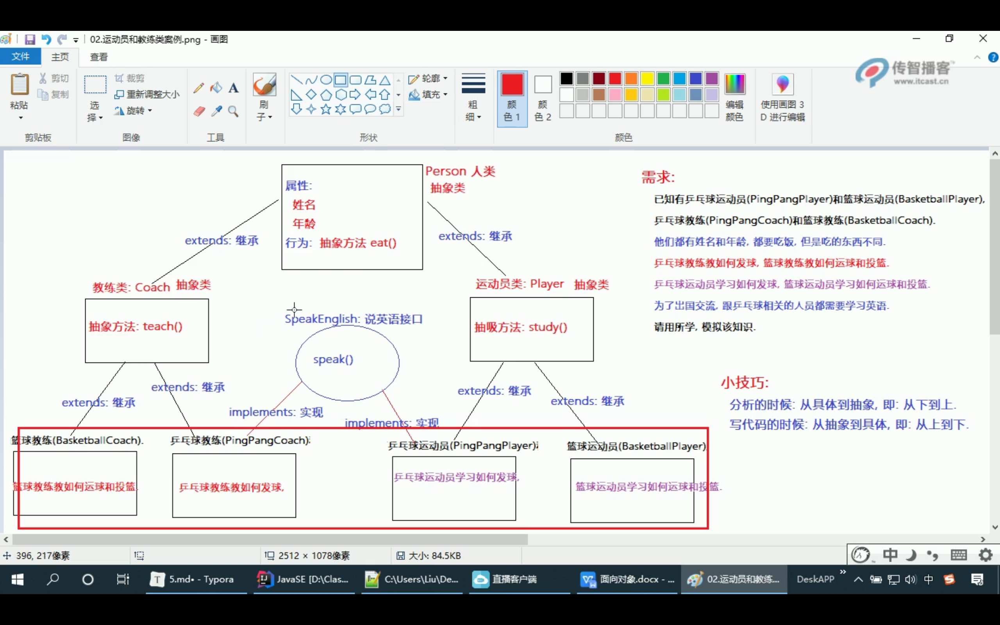

### 2022.2.17

#### java学习

+ 多态
+ 多线程
+ 面向对象

---

### 2022.2.19

#### java学习

#### 变量

> 在程序的执行过程中，其值可以在某个范围内发生变化的量就叫变量

基本数据类型

> 整型：

+ 字节型（byte）:1个字节 -2^7 ~ 2^7-1
+ 短整型（short）:2个字节 -2^15 ~ 2^15-1
+ 整型（int）:4个字节 -2^31 ~ 2^31-1
+ 长整型（long）:8个字节 -2^63 ~ 2^63-1


> 浮点型：

+ 单精度浮点型（float）:4个字节 3.4*10^(-38) ~ 3.4*10(+38)
+ 双精度浮点型（double）:8个字节 1.7*10^(-308) ~ 1.7*10(+308)

> 字符型：

+ 字符型（char）:2个字节 0 ~ 2^16-1

> 布尔型：

+ 布尔类型（boolean）:1个字节 true,false

---

### 2022.2.20

#### 命名规范

1. 类、接口的命名规范:每个单词的首字母都大写，其他字母全部小写(大驼峰命名法)
   例如:HellowWorld,VariableDemo
2. 变量,方法的命名规范:从第二个单词开始,每个单词的首字母大写,其他字母全部小写(小驼峰命名法)
   例如:zhangSanAge,studentName
3. 常量(指的是:自定义常量)的命名规范:所有字母都大写,单词直接用_隔开
   例如:MAX_VALUE,MIN_VALUE,PI
4. 包的命名规范:所有字母全部小写,多级包之间用.隔开,
   例如:cn.itcast,com.itheima

#### 数据类型转换

##### 分类

+ 自动(隐式)类型转换
  > 指的是小类型转大类型,会自动提升为大类型,运算结果是大类型
  > 细节:因为int是默认的整形,所以只要是数字运算,你能得到的最小类型就是int
  >
+ 强制(显式)类型转换
  > 指的是手动将大类型转换成小类型,运算结果是小类型
  >

ASII码表特殊字符对应的数字:
a -> 97
A -> 65
0 -> 48

---

### 2022.2.21

#### 运算符

==自增和自减包含强制类型转换==

```java
byte b1 = 10;
    b1 ++ ;    //等价于 b1 = (byte)(b1 + 1)
```

扩展的赋值运算符:

```java
+=, -= ,*=, /=, %=
```

> 例如:+=的意思是,把左边的和右边的数据相加,结果复制给左边
> ==注意:赋值运算的左边不能是常量,包含强制类型转换==

#### 短路逻辑运算符


| 符号 | 作用   | 说明                                                     |
| :----- | :------- | :--------------------------------------------------------- |
| &&   | 短路与 | 作用和&相同,但是有短路的效果,前边出现false,后边不执行    |
| \|\| | 短路或 | 作用和\|相同，但是有短路的效果，前边出现true，后边不执行 |

#### 三元运算符

> 格式:关系表达式 ? 表达式1 : 表达式2
> 执行流程:
>
> 1. 先判断关系表达式,看其结果是true还是false
> 2. ture,执行表达式1
> 3. false,执行表达式2

---

### 2022.2.22

---

### 2022.2.23

#### switch语句

1. 格式

```java
switch (表达式){
    case 值1:
        语句体1;
        break;
    case 值1:
        语句体1;
        break;
    case 值1:
        语句体1;
        break;
    default:
        语句体n:
        break;
        }
```

case穿透

> 在switch语句中，如果case的后面不写break，将出现case穿透现象，也就是不会再判断下一个case的值，直接向后运行，直到遇到break，或者整体switch结束

---

### 2022.2.24

---

### 2022.2.26

#### 打印倒三角形的两种方法：

1. 
```java
   public class LoopDemo05 {
       public static void main(String[] args) {
           for (int i = 5; i >= 1; i--) {
               for (int j = 1; j <= i; j++) {
                   System.out.print("*");
               }
               System.out.println();
           }
       }
   }
```
2. 
```java
   public class LoopDemo05 {
       public static void main(String[] args) {
           for (int i = 1; i <= 5; i++) {
               for (int j = i; j <= 5; j++) {
                   System.out.print("*");
               }
               System.out.println();
           }
       }
   }
```

---

### 2022.2.28

#### 生成随机数

Math.random() 生成0.0~1.0之间的随机数，左开右闭

```java
//使用Math类，生成5个1~10之间的随机整数，并打印
public class MathDemo01 {
    public static void main(String[] args) {
        for (int i = 0; i < 5; i++) {
            int num = (int) (Math.random() * 10 + 1);  //*几就是1到几，后面不加1就是0到几
            System.out.println(num);
        }
    }
}
```

#### 数组

+ 数组的定义格式
  1. 动态初始化

     > 我们给定长度，由系统给出默认值
     >
     > 格式一：
     >
     > 数据类型[] 数组名 = new 数据类型[长度]
     >
     > ```java
     > int[] arr = new int[3];
     > ```
     >
     > 格式二：
     >
     > 数据类型 数组名[] = new 数据类型[长度]
     >
     > ```java
     > int arr[] = new int[3];
     > ```
     >
  
  2. 静态初始化

     > 我们给定初始化值，由系统决定长度
     >
     > 格式一：
     >
     > 数据类型[] 数组名 = new 数据类型[长度]{元素一，元素二，。。。}
     >
     > ```java
     > int[] arr = new int[]{11,22,33};
     > ```
     >
     > 格式二：
     >
     > 数据类型[] 数组名 = {元素一，元素二，。。。}
     >
     > ```java
     > int[] arr = {11，22，33};
     > ```
     >

数据名.length 获取数组的长度

#### JVM的内存划分

栈：存储局部变量以及所有代码执行的

> 局部变量：指的是定义在方法中，或者方法声明上的变量
>
> 特点：先进后出

堆：存储所有new出来的内容（即：对象）

> 特点:堆中的内容会在不确定的时间，被GC回收

方法区：存储字节码文件的

> 字节码文件：指的是后缀名为.class的文件

---

### 2022.3.1

#### 空指针异常

> 产生原因：访问的对象空间为空，即：没有这个对象
>
> 解决方案：给对象赋值，即对象不能为null

#### 数组的常见操作

1. 遍历数组，取数组最大值，反转数组
   ```java
   public class ArryDemo03 {
       public static void main(String[] args) {
           int[] arr1 = {11, 22, 33, 44};
           for (int i = 0; i < arr1.length; i++) {
               System.out.println(arr1[i]);
           }
           int[] arr2 = {11, 22, 33, 44};
           int max = arr2[0];
           for (int i = 1; i < arr2.length; i++) {
               if (max < arr2[i]) {
                   max = arr2[i];
               }
           }
           System.out.println("数组的最大值：" + max);
           //反转数组第一个方法
           int[] arr3 = {11, 22, 33, 44};
           int[] arr4 = new int[arr3.length];
           int j = arr3.length-1;
           for (int i = 0; i < arr3.length; i++) {
               arr4[j] = arr3[i];
               j--;
           }
           arr3 = arr4;
           for (int i = 0; i < arr3.length; i++) {
               System.out.println(arr3[i]);
           }
           //反转数组第二个方法
           int[] arr5={11,22,33,444,55,6,7,8};
           for (int i = 0; i < arr5.length/2; i++) {
               arr5[i] = arr5[i] + arr5[arr5.length - 1 - i];
               arr5[arr5.length - 1 - i] = arr5[i] - arr5[arr5.length - 1 - i];
               arr5[i] = arr5[i] - arr5[arr5.length - 1 - i];
           }
           for (int i = 0; i < arr5.length; i++) {
               System.out.println(arr5[i]);
           }
       }
   }
   ```

#### 方法

构造方法的三个步骤

1. 明确方法名（使用小驼峰命名法）
2. 明确传入参数类型
3. 明确返回参数类型

调用方法的三个步骤

1. 写方法名，用谁就写谁
2. 传参，方法要什么，我们就给什么
3. 接收返回值，即：方法返回什么类型的值，我们就用什么类型的值接受

---

### 2022.3.2

#### 方法重载

同一个类中，出现方法名相同，但是参数列表不同的两个或两个以上的方法是称为方法重载，方法重载与方法的返回值的数据类型无关

> 注意：参数列表不同分为两种情况
>
> 1. 参数的个数不同
> 2. 对应参数的数据类型不同

#### 形参和实参

1. 基本类型作为参数时，形参的改变对实参没有任何影响

```java
public class MethodDemo08 {
    public static void main(String[] args) {
        int number=100;
        System.out.println("调用方法前"+ number);
        change(number);//实参
        System.out.println("调用方法后"+ number);
    }
    public static void change(int number){
        number =200;//形参
    }
}
```

和栈的知识点相结合，栈的特点是先进后出，后进先出，调用的change方法在main方法后进入栈，在改变number后先被弹出，所以number=200



2. 引用类型作为参数时，形参的改变直接改变实参（String类型除外）

```java
public class MethodDemo09 {
    public static void main(String[] args) {
        int[] number = {11,22,33,44};
        System.out.println("调用方法前" + number[0]);
        change(number);//实参
        System.out.println("调用方法后" + number[0]);
    }

    public static void change(int[] number) {
       number[0] =22;//形参
    }
}
```



### 2022.3.3
#### 什么是面向对象
思路：概述，思想特点，举例，总结
概述：面向对象是一种编程思想，强调的是以对象为基础，来完成各种操作，是基于面向过程的
思想特点：1 把复杂的事情简单化 2 把程序员从执行者变成指挥者 3 更符合人类的思考习惯
举例：贴合实际场景
总结：万物皆对象
#### 类的使用
+ 简述
所谓类的使用，就是**使用类中定义的成员（成员变量和成员方法）**
+ 格式
1. 创建该类的对象
类名 对象名 = new 类名（初始化值1，初始化值2）；
2. 通过对象名.的形式，调用类中的指定成员即可
//成员变量
对象名.成员变量
//成员方法
对象名.成员方法
+ 实例


---
### 2022.3.7
#### 手机类的定义和使用

---
### 2022.3.8
#### 成员变量和局部变量的区别


> 简述：
> 成员变量指的是定义在类中，方法外的变量
> 局部变量指的是定义在方法中，或者方法声明上的变量
它们的区别如下：
1. 定义位置不同
成员变量：定义在类中，方法外
局部变量：定义在方法中，或者声明方法上
2. 在内存中的存储位置不同
成员变量：存储在堆内存
局部变量：存储在栈内存
3. 生命周期不同
成员变量：随着对象的创建而存在，随着对象的消失而消失
局部变量：随着方法的调用而存在，随着方法的调用完毕而消失
4. 初始化值不同
成员变量：有默认值
局部变量：没有默认值，必须先定义，在赋值，然后才能使用
---
### 2022.3.9
#### 封装
#### private关键字
> private是一个关键字，也是访问权限修饰符的一种，它可以用来修饰类的成员（成员变量和成员方法）
特点：
被private修饰的内容只能在本类中直接使用

案例学生类：
Student.java
```java
public class Student {
    String name;
    private int age;

    public void setAge(int a) {
        if (a > 0 && a < 200) {
            age = a;
        }
    }

    public int getAge() {
        return age;
    }
}
```
StudentTest.java
```java
public class StudentTest {
    public static void main(String[] args) {
        Student st = new Student();
        st.setAge(33);
        System.out.println(st.getAge());
    }
}
```
#### This关键字
this代表本类当前对象的引用,即谁调用，this就代表谁
用来解决局部变量和成员变量重名问题的

Student.java
```java
public class Student {
    int x = 10;
    public void method(){
        int x = 20;
        System.out.println(this.x);
        System.out.println(x);
    }
}
```
StudentTest.java
```java
public class StudentTest {
    public static void main(String[] args) {
        Student st = new Student();
        st.method();
    }
}
```
#### 构造方法
格式：
1. 构造方法名必须和类名完全一致（包括大小写）
1. 构造方法没有返回值类型，连void都不能写
1. 构造方法没有具体的返回值，但是可以写return（实际开发，一般不写）

---

### 2022.3.16
构造方法，全参和空参都要构造，测试类要按照模板进行编写
Teacher类：
```java
package com.itheima.homework.demo01;

public class Teacher {
    //属性，全部私有
    private String name;
    private int age;
    private String content;
    //方法
    public void eat() {
        System.out.println("年龄为" + age + "的" + name + "老师正在吃饭。。。");
    }

    public void teach() {
        System.out.println("年龄为" + age + "的" + name + "老师正在讲" + content + "课。。。");
    }
    //构造方法，全参空参，alt+insert 快捷键
    public Teacher(String name, int age, String content) {
        this.name = name;
        this.age = age;
        this.content = content;
    }
    public Teacher() {
    }
    //get和set
    public String getName() {
        return name;
    }

    public void setName(String name) {
        this.name = name;
    }

    public int getAge() {
        return age;
    }

    public void setAge(int age) {
        this.age = age;
    }

    public String getContent() {
        return content;
    }

    public void setContent(String content) {
        this.content = content;
    }
}
```
TeacherTest:
```java
package com.itheima.homework.demo01;

public class TeacherTest {
    public static void main(String[] args) {
        //1、测试空参
        //创建对象
        Teacher t1 = new Teacher();
        //给属性赋值
        t1.setName("test");
        t1.setAge(18);
        t1.setContent("面向对象");
        //打印属性
        System.out.println("姓名 " + t1.getName());
        System.out.println("年龄 " + t1.getAge());
        System.out.println("内容 " + t1.getContent());
        //调用成员方法
        t1.teach();
        t1.eat();
        System.out.println("------------------------");
        //2、测试全参
        Teacher t2 = new Teacher("刘", 32, "面向过程");
        System.out.println("姓名 " + t2.getName());
        System.out.println("年龄 " + t2.getAge());
        System.out.println("内容 " + t2.getContent());
        t2.eat();
        t2.teach();
        System.out.println("------------------------");
    }
}
```

#### 继承
概述：
多个类中存在相同的属性和行为时，将这些内容抽取到单独的一个类中，那么这多个类就无需再定义这些属性和行为了，只要继承那个类即可，这个关系就叫继承
Person类：
```java
package com.itheima.demo11_extends;

//人类在这里充当父类
public class Person {
    private String name;
    private int age;

    public void eat() {
        System.out.println("人要吃饭");
    }

    public void sleep() {
        System.out.println("人要睡觉");
    }

    public String getName() {
        return name;
    }

    public void setName(String name) {
        this.name = name;
    }

    public int getAge() {
        return age;
    }

    public void setAge(int age) {
        this.age = age;
    }
}
```
Teacher类：
```java
package com.itheima.demo11_extends;

//老师类，继承人类
public class Teacher extends Person {
    public void teach() {
        System.out.println("老师要讲课");
    }
}
```
Student类：
```java
package com.itheima.demo11_extends;

//学生类，继承人类
public class Student extends Person {
    public void study() {
        System.out.println("学生要上课");
    }
}
```
Preson测试类：
```java
package com.itheima.demo11_extends;

public class PersonTest {
    public static void main(String[] args) {
        Teacher t1 = new Teacher();
        t1.setName("test");
        t1.setAge(18);
        System.out.println(t1.getName());
        System.out.println(t1.getAge());
        t1.eat();
        t1.sleep();
        t1.teach();
        Student s1 = new Student();
        s1.setName("test2");
        s1.setAge(22);
        System.out.println(s1.getName());
        System.out.println(s1.getAge());
        s1.eat();
        s1.sleep();
        s1.study();
    }
}
```

---
### 2022.3.21
#### 使用变量遵循的原则
使用变量遵循就近原则，局部有就用没有就去本类的成员变量位置找，有就用，没有就去父类的成员位置找，没有就报错

#### super关键字
super引用父类的成员变量，并不是引用对象，而是引用父类成员变量的内存地址

#### 继承中构造方法的特点
1. 子类中的多有构造方法默认都会访问父类的空参构造，用于子类对象访问父类数据前，对父类数据进行初始化
1. 所有的类都直接或间接继承自Object类，Object类时所有类的父类
1. 如果父类没有空参构造
    1. 可以通过spuer(参数)的方式访问父类的带参构造
    1. 也可以使用this(参数)的形式访问本类的其他构造
    1. 建议，永远手动给出空参构造

子类的空参访问父类的空参
子类的带参访问父类的带参

#### 继承关系中，成员方法的特点
继承关系中，调用成员方法中，也遵循“就近原则”。本类中有就调用
本类中没有，就去父类中查找，有就调用，没有就报错

#### 方法重写
##### 概述
> 子类中出现和父类一模一样的方法时，成为方法重写，方法重写要求返回值的数据类型也必须一样
##### 应用场景
> 当子类需要使用父类的功能，而功能主体又有自己独有的需求的时候，就可以考虑重写父类的方法了，这样，即沿袭了父类的功能，又定义了子类特有的内容
##### 注意事项
> 1. 方法重写要用@override注解来修饰
> 1. 父类中私有的方法，不能被子类重写
> 3. 子类重写父类方法时，访问权限不能更低
> private < 默认 < protected < public
> 
案例：
Phone类：
```java
package com.itheima.demo13_override;

public class Phone {
    public void call(String name) {
        System.out.println("拨号。。。");
        System.out.println("等待对象接听。。。");
        System.out.println("给" + name + "打电话。。。");
    }
}
```
NewPhone类：
```java
package com.itheima.demo13_override;

public class NewPhone extends Phone {
    @Override
    public void call(String name) {
        //调用父类的call(),实现打电话功能
        super.call(name);
        //在父类call()方法的功能上，加入自己独有的需求，播放彩铃
        System.out.println("播放彩铃。。。");
    }
}
```
PhoneTest类：
```java
package com.itheima.demo13_override;

//方法重写，子类出现和父类一样的方法是，称为方法重写
//方法重写要求返回值的数据类型也必须一致
public class PhoneTest {
    public static void main(String[] args) {
        //老手机
        Phone p = new Phone();
        p.call("test");
        System.out.println("-------------------");
        //新手机
        NewPhone np = new NewPhone();
        np.call("test2");
    }
}
```
### 2022.3.22
#### 老师和学生案例
Person父类：
```java
package com.itheima.demo14_exercise;

//父类，里面定义的是整个继承体系的共性内容
public class Person {
    private String name;
    private int age;

    public Person() {
    }

    public Person(String name, int age) {
        this.name = name;
        this.age = age;
    }

    public String getName() {
        return name;
    }

    public void setName(String name) {
        this.name = name;
    }

    public int getAge() {
        return age;
    }

    public void setAge(int age) {
        this.age = age;
    }
    //行为
    public void eat(){

    }

}
```
Teacher类，继承Person类：
```java
package com.itheima.demo14_exercise;

public class Teacher extends Person{
    //属性
//    private double salary;
    //构造方法


    public Teacher() {
    }

    public Teacher(String name, int age) {
        super(name, age);
    }
    //行为，重写父类的eat方法

    @Override
    public void eat() {
        System.out.println("老师喝牛肉汤");
    }
    public void teach(){
        System.out.println("老师要讲课");
    }
}
```
Student类，继承Person类：
```java
package com.itheima.demo14_exercise;

public class Student extends Person {
    //属性
    //构造方法


    public Student() {
    }

    public Student(String name, int age) {
        super(name, age);
    }
    //行为，重写父类的eat方法

    @Override
    public void eat() {
        System.out.println("学生吃牛肉");
    }

    public void study() {
        System.out.println("学生要学习");
    }
}
```
PersonTest类，测试老师学生类：
```java
package com.itheima.demo14_exercise;

public class PersonTest {
    public static void main(String[] args) {
        //1.测试老师类，空参构造
        //1.1 创建对象
        Teacher t = new Teacher();
        //1.2 给属性赋值
        t.setAge(23);
        t.setName("test");
        //1.3 打印属性值
        System.out.println("老师的年龄是："+t.getAge());
        System.out.println("老师的名字是："+t.getName());
        //1.4 调用方法
        t.eat();
        t.teach();
        System.out.println("--------------------");
        //2.测试老师类，全参构造
        //2.1 创建对象,并给属性赋值
        Teacher t2 = new Teacher("test2",32);
        //2.2 给属性赋值
        //2.3 打印属性值
        System.out.println("老师的年龄是："+t2.getAge());
        System.out.println("老师的名字是："+t2.getName());
        //2.4 调用方法
        t2.eat();
        t2.teach();
        System.out.println("--------------------");
        //3.测试学生类，空参构造
        Student s1 = new Student();
        s1.setAge(12);
        s1.setName("student1");
        System.out.println(s1.getAge()+"....."+s1.getName());
        s1.eat();
        s1.study();
        //4.测试学生类，全参构造
        System.out.println("--------------------");
        Student s2 = new Student("student2",14);
        System.out.println(s2.getAge()+"....."+s2.getName());
        s2.eat();
        s2.study();
    }
}
```
#### 多态
多态指的是同一个事物（或者对象）在不同时刻表现出来的不同状态

前提条件：
1. 要有继承关系
1. 要有方法重写
1. 要有父类引用指向子类对象

案例：
animal：
```java
package com.itheima.demo15_polymorphic;

public class Animal {
    public void eat(){
        System.out.println("动物要吃");
    }
}
```
cat:
```java
package com.itheima.demo15_polymorphic;

public class Cat extends Animal{
    @Override
    public void eat(){
        System.out.println("猫吃鱼");
    }
}
```
AnimalTest:
```java
package com.itheima.demo15_polymorphic;

public class AnimalTest {
    public static void main(String[] args) {
        //通过多态的形式创建动物类对象
        Animal cat1 = new Cat();
        //调用该对象的eat方法
        cat1.eat();
    }
}

```
#### 多态中的成员访问特点
+ 成员变量：编译看左边，运行看左边
    > 编译的时候，看左边的数据类型有没有这个变量，有不报错，没有就报错
    > 运行的时候，具体运行的是左边的数据类型里边的：此变量 
+ 成员方法：编译看左边，运行看右边
    > 编译的时候，看左边的数据类型有没有这个方法，有不报错，没有就报错
    > 运行的时候，具体运行的是右边的数据类型里边的：此方法 

原因是因为：方法有重写，变量没有
案例：
Person父类：
```java
package com.itheima.demo16_person;

public class Person {
    int age = 13;
    String name = "test";

    public void eat() {
        System.out.println("人要吃饭");
    }

    public Person() {
    }

    public Person(int age, String name) {
        this.age = age;
        this.name = name;
    }

    public int getAge() {
        return age;
    }

    public void setAge(int age) {
        this.age = age;
    }

    public String getName() {
        return name;
    }

    public void setName(String name) {
        this.name = name;
    }
}
```
Student子类：
```java
package com.itheima.demo16_person;

public class Student extends Person {
    int age = 23;

    @Override
    public void eat() {
        System.out.println("学生要吃饭");
    }
}
```
PersonTest测试类：
```java
package com.itheima.demo16_person;

public class PersonTest {
    public static void main(String[] args) {
        Person s1 = new Student();
        System.out.println(s1.age);
        System.out.println(s1.getAge());
        s1.eat();
    }
}
```

# 2022.8.2

## 多态 向上转型 向下转型

### 向上转型

父类型 对象名= new 子类型（）
Animal an = new Cat()

### 向下转型
子类型 对象名 = （子类型）父类对象引用
Cat c =(Cat)an

 > **注意**
 > Animal an = new Cat();
 > Cat c = (Cat)an; //这样不会报错
 > Dog d = (Dog)an;//这样会报错，ClassCastException(类型转换异常)

### 实例
1. Cat类
```java
package com.itheima.demo_01;  
  
public class Cat extends Animal {  
    public Cat() {  
    }  
  
    public Cat(String name, int age) {  
        super(name, age);  
    }  
  
    @Override  
    public void eat() {  
        System.out.println("猫吃鱼");  
    }  
  
    public void catchMouse() {  
        System.out.println("猫会抓老鼠");  
    }  
}
```

2. Dog类
```java
package com.itheima.demo_01;  
  
public class Dog extends Animal{  
    public Dog(String name, int age) {  
        super(name, age);  
    }  
  
    public Dog() {  
    }  
  
    @Override  
    public void eat() {  
        System.out.println("狗吃肉");  
    }  
    public void lookHome(){  
        System.out.println("狗会看门");  
    }  
}
```

3. Anminal类
```java
package com.itheima.demo_01;  
  
import java.sql.SQLOutput;  
  
public class Animal {  
    private String name;  
    private int age;  
  
    public Animal(String name, int age) {  
        this.name = name;  
        this.age = age;  
    }  
  
    public Animal() {  
    }  
  
    public String getName() {  
        return name;  
    }  
  
    public void setName(String name) {  
        this.name = name;  
    }  
  
    public int getAge() {  
        return age;  
    }  
  
    public void setAge(int age) {  
        this.age = age;  
    }  
  
    public void eat() {  
        System.out.println("动物要吃饭");  
    }  
}
```

4. AnimalTest测试类
```java
package com.itheima.demo_01;  
  
public class AnimalTest {  
    public static void main(String[] args) {  
  
        //Dog空参对象  
        Animal dog1 = new Dog();  
        dog1.setAge(23);  
        dog1.setName("Bob");  
        System.out.println("dog`s age:" + dog1.getAge() + "\n" + "dog`s name:" + dog1.getName());  
        Dog d1 = (Dog) dog1;  
        d1.lookHome();  
  
        //Dog全参对象  
        Animal dog2 = new Dog("case", 12);  
        System.out.println("dog`s age:" + dog2.getAge() + "\n" + "dog`s name:" + dog2.getName());  
        Dog d2 = (Dog) dog2;  
        d2.lookHome();  
  
        //Cat空参对象  
        Animal cat1 = new Cat();  
        cat1.setAge(22);  
        cat1.setName("mimi");  
        System.out.println("cat`s age:" + cat1.getAge() + "\n" + "cat`s name:" + cat1.getName());  
        Cat c1 = (Cat) cat1;  
        c1.eat();  
  
        //Cat全参对象  
        Animal cat2 = new Cat("mimi2",13);  
        System.out.println("cat`s age:" + cat2.getAge() + "\n" + "cat`s name:" + cat2.getName());  
        Cat c2 = (Cat) cat2;  
        c2.eat();  
    }  
}
```

> **扩展**
> 实际开发中，方法的形参一般写的都是父类类型，这样可以接收其任意的子类对象，然后通过多态调用成员方法的规则：编译看左，运行看右，就能调用指定子类对象的方法了，这也是多态在实际开发中最常用的场景

### 实际开发需求实例

需求：定义一个show()方法，接收任意的动物类对象，然后调用该对象的eat()方法

AnimalTeat02
```java
package com.itheima.demo_01;  
  
public class AnimalTest02 {  
  
    //需求：定义一个show()方法，接收任意的动物类对象，然后调用该对象的eat()方法  
  
  
    public static void main(String[] args) {  
        Cat c = new Cat();  
        show(c);  
        Dog d = new Dog();  
        show(d);  
        System.out.println("----------------------");  
        show2(c);  
        show2(d);  
    }  
  
    //方式一：分解版  
//    public static void show(Cat c){  
//        c.eat();  
//    }  
    //方式二：多态版  
    public static void show(Animal an) {  
        an.eat();  
    }  
  
    //扩展功能：如果是猫，就抓老鼠，如果是狗，就看门  
    public static void show2(Animal an) {  
        if (an instanceof Cat) {  
            Cat c = (Cat) an;  
            c.eat();  
        } else if (an instanceof Dog) {  
            Dog d = (Dog) an;  
            d.eat();  
        }  
    }  
}
```

### instanceof 关键字
> 格式：
> > 引用（对象）instanceof 数据类型 
> 
> 作用：
> >用来判断前边的引用（或者是对象）是否是后边的数据类型

# 2022.8.4

# 2022.9.7
## final关键字
> 可以修饰类，成员变量，成员方法
> 修饰的类：不能被继承，但是可以继承其他类
> 修饰的变量：是一个常量，只能被赋值一次，必须在变量初始化的时候进行赋值
> 修饰的方法：不能被子类重写

## static关键字
### 概述
static是一个关键字，便是静态的意思，可以修饰成员变量，成员方法
### 特点
1. 随着类的加载而加载
2. 优先于对象存在
3. 被static修饰的内容，能被该类下所有的对象共享
	> 解释：这也是我们判断是否使用静态关键字的条件
4. 可以通过**类名.**的形式调用

### 静态方法的访问特点及注意事项
+ 访问特点
> 静态方法只能访问静态的成员变量和静态的成员方法
> 简单记忆：静态只能访问静态
+ 注意事项
1. 在静态方法中，是没有this，super关键字的
2. 因为静态的内容是随类的加载而加载，而this和super是随着对象的创建而存在
3. 非静态方法可以访问所有成员（非静态变量和方法，静态变量和方法）
## 抽象类
在java中，一个没有方法体的方法应该定义为抽象方法，而类中如果有抽象方法，该类必须定义为抽象类
### 抽象类的特点
1. 抽象类和抽象方法必须使用abstract关键字修饰
```java
public abstract class Animal{} //抽象类
public abstract void eat()  //抽象方法
```
2. 抽象类中不一定有抽象方法，有抽象方法的类一定是抽象类
3. 抽象类不能实例化
	>那抽象类如何实例化？
	>可以通过多态的方式，创建其子类对象，来完成抽象类的实例化，这也叫：抽象类多态
4. 抽象类的子类
	> 1. 如果是普通类，则必须重写父抽象类中所有的抽象方法
	> 2. 如果是抽象类，则可以不用重写父抽象类中的抽象方法
### 抽象类的成员特点
抽象类中可以有变量，常量，构造方法，抽象方法和非抽象方法
**疑问一：** 既然抽象类不能实例化，那要构造方法有什么用？
**答：** 用于子类对象访问父类数据前，对父类数据进行初始化
**疑问二：** 抽象类中的抽象方法和非抽象方法的作用是什么？
**答：** 抽象方法：强制要求子类必须完成某些事情
**需求**
1. 定义抽象类Person，在类中定义变量age，常量country，空参，全参构造
2. 在Person类中定义非抽象方法show(),抽象方法eat()
3. 在测试类的main方法中，创建Person类的对象，并调用类中的成员

> 小技巧：
> 			final一般要结合static，public或者private一起使用

# 2022.9.10

## 接口

### 特点
1. 接口用interface关键字修饰
2. 类和接口之间是实现关系，用implements关键字表示
3. 接口不能实例化
> 可以通过多态的方式，创建其子类对象，来完成接口的实例化，这也叫：接口多态

4. 接口的子类：
	1. 如果是普通类，则必须重写父类接口中所有的抽象方法
	2. 如果是抽象类，则可以不用重写父接口中的抽象方法

### 成员特点
接口中有且只有常量或者抽象方法，原因因为：
+ 成员变量有默认修饰符：public static final
+ 成员方法有默认修饰符：public abstract
**注意：** 因为接口主要功能是扩展功能的，而没有具体存在，所有接口中是没有构造方法的

### 类与接口之间的关系
+ 类与类之间：继承关系，只能单继承，不能多继承，但是可以多层继承
+ 类与接口之间：实现关系，可以单实现，亦可以多实现，还可以在继承一个类的同时实现多个接口
+ 接口与接口之间：继承关系，可以单继承，也可以多继承

### 面试题
#### 抽象类和接口的区别是什么？
1. 成员区别
> 抽象类：变量，常量，构造方法，抽象方法，非抽象方法
> 接口：常量，抽象方法，静态方法，默认方法
1. 关系区别
>1. 类与类之间：继承关系，只能单继承，不能多继承，但是可以多层继承
>2. 类与接口之间：实现关系，可以单实现，亦可以多实现，还可以在继承一个类的同时是实现多个接口
>3. 接口与接口之间：继承关系，可以单继承，也可以多继承
1. 设计理念的区别
抽象类：抽象类中定义的是整个继承体系的**共性内容**
接口：接口中定义的是整个继承体系的**扩展内容**

## 运动员和教练案例
### 需求
1. 已知有乒乓球运动员（PingPangPlayer）和篮球运动员（BasketballPlayer），乒乓球教练（PingPangCoach）和篮球教练（BastetballCoach）
2. 他们都有姓名和年龄，都要吃饭，但吃的东西不同
3. 乒乓球教练教如何发球，篮球教练教如何运球和投篮
4. 乒乓球运动员学习如何发球，篮球运动员学习如何运球和投篮
5. 为了出国交流，跟乒乓球相关的人员都需要学习英语

# 2022.9.11
## 包
### 简述
包(package)就是文件夹，用来对类进行分类管理的
### 格式
package 包名1.包名2.包名3
**注意：**
1.  package语句必须是程序的第一条可执行代码
2. package语句在一个.java文件中只能有一个
### 常见分类
+ 按照功能分
+ 按照模块分
## 导包
全类名=包名+类名
**注意事项：**
1. java.lang下的类不需要import可以直接使用
2. 用public修饰的类叫公共类，也叫顶级类，在一个.java文件中，顶级类只能有一个，且必须和文件名一致
## 权限修饰符
### 概述
权限修饰符是用来修饰类，成员变量，构造方法，成员方法的，不同的权限修饰符对应的功能不同，具体如下

|| public | protected | 默认 | private |
|:-|:-:|:-:|:-:|:-:|
|同一个类中 | √ | √ | √ | √ |
| 同一个包中的子类或者其他类 | √ | √ | √ |  |
| 不同包中的子类 | √ | √ |  |  |
| 不同包中的其他类（无关类） | √ |  |  |  |
### 结论
1. 访问权限修饰符的权限从大到小分别是：public > protected > 默认 > private
2. 在实际开发中，如果没有特殊要求，则成员变量都用private修饰，其他都用public修饰
3. 大白话总结4个访问权限修饰符的作用：
> private:       强调的是给    自己             使用
> 默认:           强调的是给    同包下的类  使用
> protected   强调的是给    子类              使用
> public:        强调的是给     大家             使用
## toString方法
该方法可以打印当前类中的属性值，使用方法见代码
Student类
```java
package com.itheima.demo13_tostring;  
  
public class Student {  
    private String name;  
    private int age;  
    private String sex;  
    private String email;  
  
    public Student() {  
    }  
  
    public Student(String name, int age, String sex, String email) {  
        this.name = name;  
        this.age = age;  
        this.sex = sex;  
        this.email = email;  
    }  
  
    public String getName() {  
        return name;  
    }  
  
    public void setName(String name) {  
        this.name = name;  
    }  
  
    public int getAge() {  
        return age;  
    }  
  
    public void setAge(int age) {  
        this.age = age;  
    }  
  
    public String getSex() {  
        return sex;  
    }  
  
    public void setSex(String sex) {  
        this.sex = sex;  
    }  
  
    public String getEmail() {  
        return email;  
    }  
  
    public void setEmail(String email) {  
        this.email = email;  
    }  
  
    //自定义一个show()方法来获取所有的成员变量值  
    public String show() {  
        return name + "..." + sex + "..." + age + "..." + email;  
    }  
  
    @Override  
    public String toString() {  
        return "Student{" +  
                "name='" + name + '\'' +  
                ", age=" + age +  
                ", sex='" + sex + '\'' +  
                ", email='" + email + '\'' +  
                '}';  
    }  
}
```
StudentTest类：
```java
package com.itheima.demo13_tostring;  
  
public class StudentTest {  
    public static void main(String[] args) {  
        Student s = new Student("Bob",23,"male","gkjuamao@gmail.com");  
        System.out.println(s.show());  
        System.out.println(s.toString());  
        System.out.println(s);  //输出语句会直接调用类中的toString方法
    }  
}
```

## 面向对象总结
### 面向对象入门概述
#### 什么事面向对象？
#### 了解：面向过程
#### 你为什么要学习编程语言？
就是把显示世界的事务通过编程语言描述出来，实现信息化
#### 我们是如何描述现实世界的事物的呢？
1. 属性：名词，事物的外在特征
2. 特征：动词，事物能够做什么

#### 和面向对象相关的概念
类：属性，行为的集合，抽象，看不见
对象：
成员变量：
成员方法：

#### 类的定义格式
```java
public class Student(){

}
```

#### 如何使用类中的成员
1. 创建对象
2. 通过对象名.的形式调用

### 三大特征

#### 封装

#### 继承

#### 多态

### 面向对象其他内容

## homework
1. 已知有猫类和狗类，它们都有姓名和年龄，都要吃饭，不同的是猫吃鱼，狗吃肉，它们都有跑步的功能，而且仅仅是跑步，并无任何区别，猫独有自己的功能：抓老鼠catchMouse()，狗独有自己的功能：看家lookHome()，部分猫和狗经过马戏团的训练后，学会了跳高jump().
代码见homework_01
2. 已知传智播客公司有基础班老师(BasicTeacher)和就业班老师(WorkTeacher)，基础班学生(BasicStudent)和就业班学生(WorkStudent)，他们都有姓名，年龄，都要吃饭，不同的是学生吃牛肉，老师喝牛肉汤，老师有自己的额外属性：工资(salary)，且老师需要讲课（基础班老师讲JavaSE，就业班老师讲JavaEE），基础班学生学JavaSE，就业班学生学JavaEE，为了扩大就业市场，跟就业班相关的人员都需要学习英语
代码见homework_03

# 2022.9.13
## API简介
+ API全称是Application Programming Interface（应用程序编程接口）
+ Java API：指的就是JDK中提供的各种功能的Java类
### Scanner中遇到的问题
+ 问题描述：使用nextInt()接收整数时候，再使用nextLine()接收不到字符串
+ 问题原因：nextInt()只接收整数，完成输入的/r/n不接收，此时使用nextLine()，接收到/r/n则直接结束接收
+ 问题解决：1.使用next() 2. 调用两次nextLine() 3.重新new一个Scanner 4
	1. 使用next()
	2. 调用两次nextLine() 
	3. 重新new一个Scanner
	4. 实际开发中，都用字符串接收，然后把字符串类型的数字，转成对应的int类型数字即可

## Object类
### 概述
Object类是所有类的父类，所有的类都直接或间接继承子Object类
### 构造方法
public Object() //Object类中只有一个空参构造
### 成员方法
public String toString(); 
返回对象的字符串表示形式(即地址值)，无意义，子类一般都会重写该方法
public boolean equals(Object obj);
比较两个对象是否相等，默认比较的是地址值，无异议，子类一般都会重写该方法
实际开发中，我们认为如果同一个类的两个对象，各个属性值都相同，那么它们就是同一个对象

## String类
### 概述
String代表字符串类，即：有多个字符组成的一串数据，**字符串的本质就是一个字符数组**
### 构造方法
+ public String()
	> 创建一个空白字符串对象，不包含任何内容
+ public String(String s)
	> 把字符串数据封装成字符串对象
+ public String(char[] value)
	> 把字符数组的数据封装成字符串对象
	
+ pubilc String(char[] value, int index, int count)
	>把字符数组的一部分数据封装成字符串对象
	
+ public String(byte[] bys)
	> 把字节数组的数据封装成字符串对象
	
+ public String(byte[] bys, int index, int count)
	> 把字节数组的一部分数据封装成字符串对象
	

# 2022.9.14
String直接创建出来的对象实际上是同一个
String s1 = "abc";
String s2 = "abc";
s1\=\=s2
判断为true
## 字符串的比较
### 涉及到的方法
+ public boolean equals(Object obj)
	+ 比较两个字符串的内容是否相等，**区分大小写** 
+ public boolean equalsIgnoreCase(String s)
	+ 比较两个字符串的内容是否相等，**不区分大小写** 
## Java的常量优化机制
java中针对于常量是有优化机制的：
针对byte类型：
> 如果是常量相加：会直接运算，然后看结果在不在左边的数据类型内，在不报错，不在就报错
> 如果是变量相加：会提类型，然后运算，提升规则：byte,short,char -> int -> long -> float -> double

针对String类型：
> 如果是常量拼接：会直接拼接，不会在堆区开辟新空间
> 如果是变量拼接：会在堆区开辟新空间


## 排序的几种方法

插入排序，交换排序，选择排序，归并排序，分配排序


## 2种GC回收机制

1. 增量收集器：增量收集器把堆栈分为多个域，每次仅从一个域收集垃圾，这会造成较小的应用程序中断
2. 分代收集器：这种收集器把堆栈分为两个或多个域，用以存放不同寿命的对象，JVM生成的新对象一般放在其中的某个域中，过一段时间继续存在的对象将获得使用期并转入更长寿的域中，分代收集器对不同的域使用不同的算法以优化性能

---


# 2023.1.13

# Collection

## ArrayList

### 概述

*ArrayList*实现了*List*接口，是顺序容器，即元素存放的数据与放进去的顺序相同，**允许放入`null`元素**，底层通过**数组实现**。除该类未实现同步外，其余跟*Vector*大致相同。每个*ArrayList*都有一个容量(capacity)，表示底层数组的实际大小，容器内存储元素的个数不能多于当前容量。当向容器中添加元素时，如果容量不足，容器会自动增大底层数组的大小。前面已经提过，Java泛型只是编译器提供的语法糖，所以这里的数组是一个Object数组，以便能够容纳任何类型的对象。

### 方法

add()

addAll()

set()

get()

remove()

trimToSize()

indexOf()

lastIndexOf()

## LinkedList

### 概述

*LinkedList*同时实现了*List*接口和*Deque*接口，也就是说它既可以看作一个顺序容器，又可以看作一个队列(*Queue*)，同时又可以看作一个栈(*Stack*)。这样看来，*LinkedList*简直就是个全能冠军。当你需要使用栈或者队列时，可以考虑使用*LinkedList*，一方面是因为Java官方已经声明不建议使用*Stack*类，更遗憾的是，Java里根本没有一个叫做*Queue*的类(它是个接口名字)。关于栈或队列，现在的首选是*ArrayDeque*，它有着比*LinkedList*(当作栈或队列使用时)有着更好的性能。

### 实现

*LinkedList*底层**通过双向链表实现**，双向链表的每个节点用内部类*Node*表示。*LinkedList*通过`first`和`last`引用分别指向链表的第一个和最后一个元素。注意这里没有所谓的哑元，当链表为空的时候`first`和`last`都指向`null`。

### 方法

getFirst(), getLast()

> 获取第一个元素， 和获取最后一个元素:

removeFirst(), removeLast(), remove(e), remove(index)

> `remove()`方法也有两个版本，一个是删除跟指定元素相等的第一个元素`remove(Object o)`，另一个是删除指定下标处的元素`remove(int index)`。

add()

> *add()\*方法有两个版本，一个是`add(E e)`，该方法在\*LinkedList*的末尾插入元素，因为有`last`指向链表末尾，在末尾插入元素的花费是常数时间。只需要简单修改几个相关引用即可；另一个是`add(int index, E element)`，该方法是在指定下表处插入元素，需要先通过线性查找找到具体位置，然后修改相关引用完成插入操作。

addAll()

> addAll(index, c) 实现方式并不是直接调用add(index,e)来实现，主要是因为效率的问题，另一个是fail-fast中modCount只会增加1次；

clear()

> 为了让GC更快可以回收放置的元素，需要将node之间的引用关系赋空。

Positional Access 方法

> get() 通过index获取元素
>
> set() 将某个位置的元素重新赋值
>
> remove() 删除指定位置的元素

查找操作

> indexOf()
>
> lastIndexOf()

Queue 方法

Deque 方法

## Stack & Queue概述

Java里有一个叫做*Stack*的类，却没有叫做*Queue*的类(它是个接口名字)。当需要使用栈时，Java已不推荐使用*Stack*，而是推荐使用更高效的*ArrayDeque*；既然*Queue*只是一个接口，当需要使用队列时也就首选*ArrayDeque*了(次选是*LinkedList*)。

### Queue

*Queue*接口继承自Collection接口，除了最基本的Collection的方法之外，它还支持额外的*insertion*, *extraction*和*inspection*操作。这里有两组格式，共6个方法，一组是抛出异常的实现；另外一组是返回值的实现(没有则返回null)。

|         | Throws exception | Returns special value |
| ------- | ---------------- | --------------------- |
| Insert  | add(e)           | offer(e)              |
| Remove  | remove()         | poll()                |
| Examine | element()        | peek()                |

### Deque

`Deque`是"double ended queue", 表示双向的队列，英文读作"deck". Deque 继承自 Queue接口，除了支持Queue的方法之外，还支持`insert`, `remove`和`examine`操作，由于Deque是双向的，所以可以对队列的头和尾都进行操作，它同时也支持两组格式，一组是抛出异常的实现；另外一组是返回值的实现(没有则返回null)。共12个方法如下:

|         | First Element - Head |               | Last Element - Tail |               |
| ------- | -------------------- | ------------- | ------------------- | ------------- |
|         | Throws exception     | Special value | Throws exception    | Special value |
| Insert  | addFirst(e)          | offerFirst(e) | addLast(e)          | offerLast(e)  |
| Remove  | removeFirst()        | pollFirst()   | removeLast()        | pollLast()    |
| Examine | getFirst()           | peekFirst()   | getLast()           | peekLast()    |

*Deque*的含义是“double ended queue”，即双端队列，它既可以当作栈使用，也可以当作队列使用。下表列出了*Deque*与*Queue*相对应的接口:

| Queue Method | Equivalent Deque Method | 说明                                   |
| ------------ | ----------------------- | -------------------------------------- |
| `add(e)`     | `addLast(e)`            | 向队尾插入元素，失败则抛出异常         |
| `offer(e)`   | `offerLast(e)`          | 向队尾插入元素，失败则返回`false`      |
| `remove()`   | `removeFirst()`         | 获取并删除队首元素，失败则抛出异常     |
| `poll()`     | `pollFirst()`           | 获取并删除队首元素，失败则返回`null`   |
| `element()`  | `getFirst()`            | 获取但不删除队首元素，失败则抛出异常   |
| `peek()`     | `peekFirst()`           | 获取但不删除队首元素，失败则返回`null` |

下表列出了*Deque*与*Stack*对应的接口:

| Stack Method | Equivalent Deque Method | 说明                                   |
| ------------ | ----------------------- | -------------------------------------- |
| `push(e)`    | `addFirst(e)`           | 向栈顶插入元素，失败则抛出异常         |
| 无           | `offerFirst(e)`         | 向栈顶插入元素，失败则返回`false`      |
| `pop()`      | `removeFirst()`         | 获取并删除栈顶元素，失败则抛出异常     |
| 无           | `pollFirst()`           | 获取并删除栈顶元素，失败则返回`null`   |
| `peek()`     | `getFirst()`            | 获取但不删除栈顶元素，失败则抛出异常   |
| 无           | `peekFirst()`           | 获取但不删除栈顶元素，失败则返回`null` |

## ArrayDeque

从名字可以看出*ArrayDeque*底层通过数组实现，为了满足可以同时在数组两端插入或删除元素的需求，该数组还必须是循环的，即**循环数组(circular array)**，也就是说数组的任何一点都可能被看作起点或者终点。*ArrayDeque*是非线程安全的(not thread-safe)，当多个线程同时使用的时候，需要程序员手动同步；另外，该容器**不允许放入`null`元素**。


上图中我们看到，**`head`指向首端第一个有效元素，`tail`指向尾端第一个可以插入元素的空位**。因为是循环数组，所以`head`不一定总等于0，`tail`也不一定总是比`head`大。

## PriorityQueue

### 概述

*PriorityQueue*，即优先队列。**优先队列的作用是能保证每次取出的元素都是队列中权值最小的**(Java的优先队列每次取最小元素，C++的优先队列每次取最大元素)。这里牵涉到了大小关系，**元素大小的评判可以通过元素本身的自然顺序(\*natural ordering\*)，也可以通过构造时传入的比较器**(*Comparator*，类似于C++的仿函数)。

Java中*PriorityQueue*实现了*Queue*接口，**不允许放入`null`元素**；其通过堆实现，具体说是通过完全二叉树(*complete binary tree*)实现的**小顶堆**(任意一个非叶子节点的权值，都不大于其左右子节点的权值)，也就意味着可以通过数组来作为*PriorityQueue*的底层实现。


上图中我们给每个元素按照层序遍历的方式进行了编号，如果你足够细心，会发现父节点和子节点的编号是有联系的，更确切的说父子节点的编号之间有如下关系:

```
leftNo = parentNo*2+1
rightNo = parentNo*2+2
parentNo = (nodeNo-1)/2
```

通过上述三个公式，可以轻易计算出某个节点的父节点以及子节点的下标。这也就是为什么可以直接用数组来存储堆的原因。

### 方法

#### add()和offer()

`add(E e)`和`offer(E e)`的语义相同，都是向优先队列中插入元素，只是`Queue`接口规定二者对插入失败时的处理不同，前者在插入失败时抛出异常，后则则会返回`false`。对于*PriorityQueue*这两个方法其实没什么差别。

#### element()和peek()

`element()`和`peek()`的语义完全相同，都是获取但不删除队首元素，也就是队列中权值最小的那个元素，二者唯一的区别是当方法失败时前者抛出异常，后者返回`null`。根据小顶堆的性质，堆顶那个元素就是全局最小的那个；由于堆用数组表示，根据下标关系，`0`下标处的那个元素既是堆顶元素。所以**直接返回数组`0`下标处的那个元素即可**。

#### remove()和poll()

`remove()`和`poll()`方法的语义也完全相同，都是获取并删除队首元素，区别是当方法失败时前者抛出异常，后者返回`null`

# Map

## Java8 HashMap

*HashMap*实现了*Map*接口，即允许放入`key`为`null`的元素，也允许插入`value`为`null`的元素；除该类未实现同步外，其余跟`Hashtable`大致相同；跟*TreeMap*不同，该容器不保证元素顺序，根据需要该容器可能会对元素重新哈希，元素的顺序也会被重新打散，因此不同时间迭代同一个*HashMap*的顺序可能会不同。 根据对冲突的处理方式不同，哈希表有两种实现方式，一种开放地址方式(Open addressing)，另一种是冲突链表方式(Separate chaining with linked lists)。**Java7 \*HashMap\*采用的是冲突链表方式**


Java8 对 HashMap 进行了一些修改，最大的不同就是利用了红黑树，所以其由 **数组+链表+红黑树** 组成。

根据 Java7 HashMap 的介绍，我们知道，查找的时候，根据 hash 值我们能够快速定位到数组的具体下标，但是之后的话，需要顺着链表一个个比较下去才能找到我们需要的，时间复杂度取决于链表的长度，为 O(n)。

为了降低这部分的开销，在 Java8 中，当链表中的元素达到了 8 个时，会将链表转换为红黑树，在这些位置进行查找的时候可以降低时间复杂度为 O(logN)。

来一张图简单示意一下吧:


从上图容易看出，如果选择合适的哈希函数，`put()`和`get()`方法可以在常数时间内完成。但在对*HashMap*进行迭代时，需要遍历整个table以及后面跟的冲突链表。因此对于迭代比较频繁的场景，不宜将*HashMap*的初始大小设的过大。

有两个参数可以影响*HashMap*的性能: 初始容量(inital capacity)和负载系数(load factor)。初始容量指定了初始`table`的大小，负载系数用来指定自动扩容的临界值。当`entry`的数量超过`capacity*load_factor`时，容器将自动扩容并重新哈希。对于插入元素较多的场景，将初始容量设大可以减少重新哈希的次数。

将对象放入到*HashMap*或*HashSet*中时，有两个方法需要特别关心: `hashCode()`和`equals()`。**`hashCode()`方法决定了对象会被放到哪个`bucket`里，当多个对象的哈希值冲突时，`equals()`方法决定了这些对象是否是“同一个对象”**。所以，如果要将自定义的对象放入到`HashMap`或`HashSet`中，需要**@Override** `hashCode()`和`equals()`方法。

### 方法

#### get()

`get(Object key)`方法根据指定的`key`值返回对应的`value`，该方法调用了`getEntry(Object key)`得到相应的`entry`，然后返回`entry.getValue()`。因此`getEntry()`是算法的核心。 算法思想是首先通过`hash()`函数得到对应`bucket`的下标，然后依次遍历冲突链表，通过`key.equals(k)`方法来判断是否是要找的那个`entry`。

#### put()

`put(K key, V value)`方法是将指定的`key, value`对添加到`map`里。该方法首先会对`map`做一次查找，看是否包含该元组，如果已经包含则直接返回，查找过程类似于`getEntry()`方法；如果没有找到，则会通过`addEntry(int hash, K key, V value, int bucketIndex)`方法插入新的`entry`，插入方式为**头插法**。

#### remove()

`remove(Object key)`的作用是删除`key`值对应的`entry`，该方法的具体逻辑是在`removeEntryForKey(Object key)`里实现的。`removeEntryForKey()`方法会首先找到`key`值对应的`entry`，然后删除该`entry`(修改链表的相应引用)。查找过程跟`getEntry()`过程类似。

## HashSet

前面已经说过*HashSet*是对*HashMap*的简单包装，对*HashSet*的函数调用都会转换成合适的*HashMap*方法，因此*HashSet*的实现非常简单，只有不到300行代码。


# 深拷贝和浅拷贝

- **浅拷贝**：浅拷贝会在堆上创建一个新的对象（区别于引用拷贝的一点），不过，如果原对象内部的属性是引用类型的话，浅拷贝会直接复制内部对象的引用地址，也就是说拷贝对象和原对象共用同一个内部对象。
- **深拷贝** ：深拷贝会完全复制整个对象，包括这个对象所包含的内部对象。
- **引用拷贝呢** ：简单来说，引用拷贝就是两个不同的引用指向同一个对象。


# Object 类的常见方法

```java
/**
 * native 方法，用于返回当前运行时对象的 Class 对象，使用了 final 关键字修饰，故不允许子类重写。
 */
public final native Class<?> getClass()
/**
 * native 方法，用于返回对象的哈希码，主要使用在哈希表中，比如 JDK 中的HashMap。
 */
public native int hashCode()
/**
 * 用于比较 2 个对象的内存地址是否相等，String 类对该方法进行了重写以用于比较字符串的值是否相等。
 */
public boolean equals(Object obj)
/**
 * naitive 方法，用于创建并返回当前对象的一份拷贝。
 */
protected native Object clone() throws CloneNotSupportedException
/**
 * 返回类的名字实例的哈希码的 16 进制的字符串。建议 Object 所有的子类都重写这个方法。
 */
public String toString()
/**
 * native 方法，并且不能重写。唤醒一个在此对象监视器上等待的线程(监视器相当于就是锁的概念)。如果有多个线程在等待只会任意唤醒一个。
 */
public final native void notify()
/**
 * native 方法，并且不能重写。跟 notify 一样，唯一的区别就是会唤醒在此对象监视器上等待的所有线程，而不是一个线程。
 */
public final native void notifyAll()
/**
 * native方法，并且不能重写。暂停线程的执行。注意：sleep 方法没有释放锁，而 wait 方法释放了锁 ，timeout 是等待时间。
 */
public final native void wait(long timeout) throws InterruptedException
/**
 * 多了 nanos 参数，这个参数表示额外时间（以毫微秒为单位，范围是 0-999999）。 所以超时的时间还需要加上 nanos 毫秒。。
 */
public final void wait(long timeout, int nanos) throws InterruptedException
/**
 * 跟之前的2个wait方法一样，只不过该方法一直等待，没有超时时间这个概念
 */
public final void wait() throws InterruptedException
/**
 * 实例被垃圾回收器回收的时候触发的操作
 */
protected void finalize() throws Throwable { }

```

# 常见的RuntimeException

`NullPointerException`(空指针错误)

`IllegalArgumentException`(参数错误比如方法入参类型错误)

`NumberFormatException`（字符串转换为数字格式错误，`IllegalArgumentException`的子类）

`ArrayIndexOutOfBoundsException`（数组越界错误）

`ClassCastException`（类型转换错误）

`ArithmeticException`（算术错误）

`SecurityException` （安全错误比如权限不够）

`UnsupportedOperationException`(不支持的操作错误比如重复创建同一用户)

